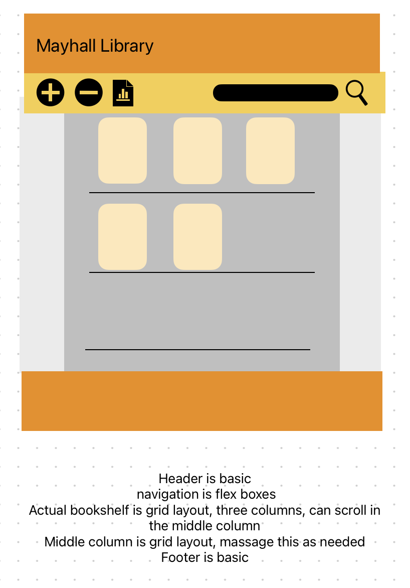

# odin-library
Repo for the library project in the javascript course of the Odin Project

# Process Notes

8/6/23 - 8/7/23 

- Began the project by sketching ideas for the UI in Freeform 

- Concept is that when a card is clicked, it opens an overlay with the book information 
- Implemented the design with the intention to iterate later 
    - Decor in the blank spaces
    - Decorative buttons rather than text buttons
    - Better responsive UI
        - Looks terrible on iPhone
        - If squished, the cards get pretty small